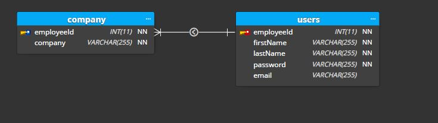

# GraphQl-Authentication
A simple graphql and apollo server API for JWT based authentication.

## Folder Structure:-

### **Config**
Contains config.js file where the configuration for MySQL database is defined which is required for connecting to the database.

### **Migrations**
Contains sequelize migrations models for company and user tables. These define parameters for when we run the initial create table command on our database.

### **src**
Source files that have most of the server code. Migrations and Config are not inside src folder since they are only used once initially before running the code and not while the code is running.

### **src/models**           
Contains SQL models for company and user in respective files. User has a hook which has functions that run before certain type of queries.

`beforeCreate` this hook is called when create query is being called. The hook contains logic to hash the password with a salt so that we don’t store un-encrypted password in database.
`beforeUpdate` this hook is called when update query is being called on user table. Just as before it hashesh the updated password.
`User.validPassword ` is a class Methods which users bcrypt to compare the hash stored in db against a string to check if both are same.
`User.associate` is one-to-one association with company table with employeeId foreign key.

The *`index.js`* contains the code for connecting seqelize to database. It also takes all the models defined in the models folder, and it applies them to the “db” object. so if you have a model in the models folder, and it’s name is “User”, it will be found on the db object as db.User 

### **src/resolver**
Resolvers contain the functions that are called for respective query and mutaion. They take in 4 arguments 
1. `root` contains the result returned from the resolver on the parent field.
2. `args` arguments passed into the field in the query.
3. `context` object shared by all resolvers in a particular query.
4.  `info` contains information about the execution state of the query.

The `query` object in `getUserList` is a dynamic object which changes values based on arguments passed to the query.All arguments are optional.All queries require an Authorization header with valid jwt token.

### **src/schema**
Schema is at the core of any GraphQL and defines the functionality available to the client applications that connect to it, also defines all the query and mutations the client can use along with their parameters and what data type they return.

## Database design
There are two tables the user table which has employeeId as primary and foreign key and has all user details except for the company. The company table which has employeeId as primary and foreign key and a company column.


# Graphql Queries available

### Register
```
mutation {
  registerUser(
      name: "Judika"
      email: "Judika@gmail.com"
      password: "polo30"
  )
  {
      id
      name
      email
      password
      date
      exp
      points
      avatar
    }
}
```
### Login
```
mutation {
  login(email: "b@gmail.com", password: "polo30") {
    token
    user {
        id
        name
        email
        password
        date
        exp
        points
        avatar
    }
  }
}
```
### Update Profile
```
mutation updateUser {
  updateUser(
      name: "dika"
      email : "aryadhika2020@gmail.com"
      password : "polo30"
      avatar : "https://res.cloudinary.com/de24jpu9k/image/upload/v1671761158/cld-sample.jpg"
      ) {
    name
    email
    password
    avatar
  }
}

```
### Forgot Password
```
mutation{
    forgotPassword(email: "jika@gmail.com", password: "polo30"){
        email
        password
    }
}

```
### Admin/Upload Soal
```
mutation uploadsoal {
    uploadSoal(
        category: "listening",
        episode: 1,
        level: 7,
        question: "Sajjaadatun",
        answer1: "Sajjaatun",
        answer2: "Sajjadutan",
        answer3: "Sajjaadatun",
        answer4: "Sujjaadatun",
        correctanswer: 3
    ){
        category
        episode
        question
        answer1
        answer2
        answer3
        answer4
        correctanswer
    }
}

```
### Get Level Detail
```
mutation savedUserProgress {
    savedUserProgress(
    category: "reading"
    episode: 1
    level: 1
    isCompleted: false
    ) {
    category
    episode
    level
    createdAt
    isCompleted
  }
}

```
### Get Profile User
```
query {
    getProfile{
        userCheck{
          id
        name
        email
        password
        date
        exp
        points
        avatar
        }
        level
        rank
    }
}

```
### Get User Saved Level
```
query getUserSavedLevel {
    getUserSavedLevel(
        category:"listening"
        episode: 1
    )
    {
    id,
    category,
    episode,
    level,
    createdAt,
    isCompleted  
    }
}

```
### Get Level List
```
query{
    getUserLevel(
        category: "listening",
        episode: 1
    ){
    id
    category
    episode
    level
    question
    answer1
    answer2
    answer3
    answer4
    correctanswer
    sound
    isCompleted
    }
}

```
### Get Progress
```
query{
    getProgress(
        category: "listening",
        episode: 1
    ){
        true
        false
        notStarted
    }
}

```
### Get Episode
```
query {
    getEpisode (
        category: "listening"
    ){
        episode 
        progress
        level
    }
}

```
### Get Leaderboard
```
query{
    getLeaderboard{
        id
        name
        exp
        points
        avatar
    }
}

```